# 🎮 Try2Cheat

**Try2Cheat** é um Jogo 2D com mecânicas arcade desenvolvida como projeto prático da disciplina de **Computação Gráfica**.

O intuito do jogo é conseguir colar na prova sem ser pego pelo professor, administrando o momento certo de usar o celular e controlando o risco durante a partida. 
A partir dessa proposta, o projeto aplica, de forma visual e interativa, conceitos como rasterização, preenchimento, animação 2D, transformações geométricas, janela, viewport, clipping e texturização.


---

## 🖼️ Preview do jogo

<table width="835" cellspacing="0" cellpadding="0">
  <tr>
    <td width="417" valign="top">
      <h2>🕹️ Como jogar</h2>
      <h3>🎯 Objetivo</h3>
      <table width="417" cellspacing="0" cellpadding="6">
        <tr align="center">
          <th width="125">Meta</th>
          <th width="230">Descrição</th>
          <th width="62">Ícone</th>
        </tr>
        <tr align="center">
          <td>Completar a cola</td>
          <td>Preencha a barra na hora certa.</td>
          <td>
            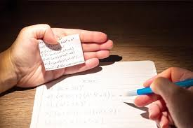
          </td>
        </tr>
        <tr align="center">
          <td>Evitar suspeitas</td>
          <td>Não deixe o professor perceber.</td>
          <td>
            
          </td>
        </tr>
        <tr align="center">
          <td>Concluir a prova</td>
          <td>Termine antes do tempo acabar.</td>
          <td>
            
          </td>
        </tr>
      </table>
      <br>
      <h3>⌨️🖱️ Controles</h3>
      <table width="417" cellspacing="0" cellpadding="6">
        <tr align="center">
          <th width="95">Tecla</th>
          <th width="260">Descrição</th>
          <th width="62">Ícone</th>
        </tr>
        <tr align="center">
          <td><strong>ESPAÇO</strong></td>
          <td>Pegar ou guardar o celular</td>
          <td>
            
          </td>
        </tr>
        <tr align="center">
          <td><strong>SETAS</strong></td>
          <td>Mover a câmera</td>
          <td>
            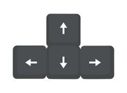
          </td>
        </tr>
        <tr align="center">
          <td><strong>SCROLL</strong></td>
          <td>Aplicar zoom da câmera</td>
          <td>
            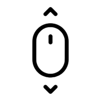
          </td>
        </tr>
        <tr align="center">
          <td><strong>ESC</strong></td>
          <td>Voltar ao menu</td>
          <td>
            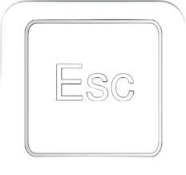
          </td>
        </tr>
        <tr align="center">
          <td><strong>R</strong></td>
          <td>Reiniciar</td>
          <td>
            
          </td>
        </tr>
      </table>
    </td>
    <td width="400" valign="middle" align="center">
      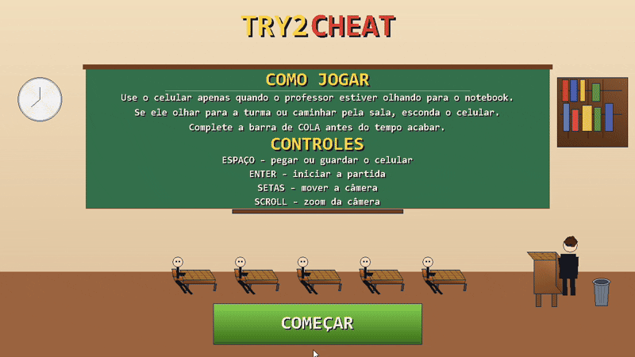
    </td>
  </tr>
</table>

---

## ⚠️ Mecânicas principais

<table width="100%">
  <tr align="center">
    <th width="30%">Mecânica</th>
    <th width="60%">Descrição</th>
    <th width="10%">GIF</th>
  </tr>
  <tr align="center">
    <td><strong>Barra de COLA</strong></td>
    <td>Progresso ao consultar o celular.</td>
    <td>
      
    </td>
  </tr>
  <tr align="center">
    <td><strong>Barra de RISCO</strong></td>
    <td>Perigo crescente ao ser observado.</td>
    <td>
      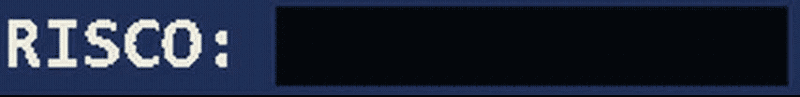
    </td>
  </tr>
  <tr align="center">
    <td><strong>Professor</strong></td>
    <td>Alterna entre vigiar, andar e retornar.</td>
    <td>
      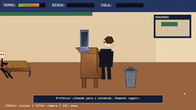
    </td>
  </tr>
  <tr align="center">
    <td><strong>Câmera</strong></td>
    <td>Movimentação, zoom e minimapa.</td>
    <td width="600">
      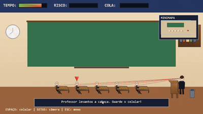
    </td>
  </tr>
</table>

---

## ✅ Regras de negócio atendidas

<table width="100%">
  <tr align="center">
    <th width="30%">Regra / Requisito</th>
    <th width="50%">Onde foi utilizado</th>
    <th width="20%">Representação</th>
  </tr>
  <tr align="center">
    <td><strong>Projeto em Pygame</strong></td>
    <td>Todo o jogo foi desenvolvido em Python utilizando a biblioteca Pygame.</td>
    <td>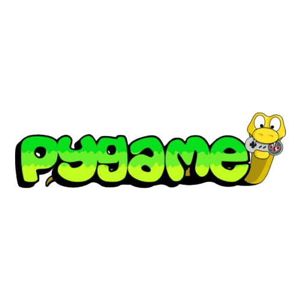</td>
  </tr>
  <tr align="center">
    <td><strong>Set Pixel</strong></td>
    <td>Implementado no rasterizador como base para os algoritmos gráficos do projeto.</td>
    <td>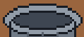</td>
  </tr>
  <tr align="center">
    <td><strong>Reta, Circunferência e Elipse</strong></td>
    <td>Usadas na abertura, no relógio, na lixeira e em detalhes estruturais do cenário.</td>
    <td>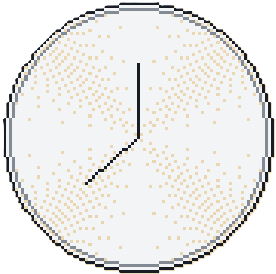</td>
  </tr>
  <tr align="center">
    <td><strong>Flood Fill e Scanline</strong></td>
    <td>Aplicados no preenchimento da lixeira e dos polígonos do cenário, interface e personagens.</td>
    <td>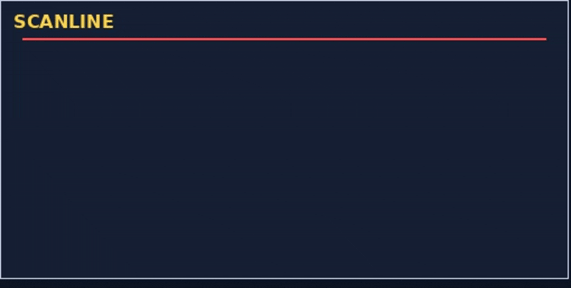</td>
  </tr>
  <tr align="center">
    <td><strong>Translação, Escala e Rotação</strong></td>
    <td>Usadas nos personagens, no posicionamento da cena e nas animações do jogo.</td>
    <td>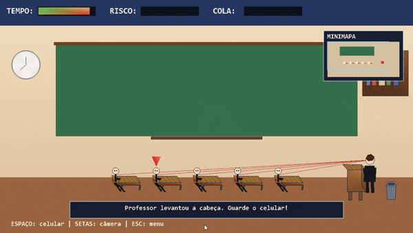</td>
  </tr>
  <tr align="center">
    <td><strong>Animação 2D</strong></td>
    <td>Presente na caminhada do professor e na animação do celular do aluno.</td>
    <td>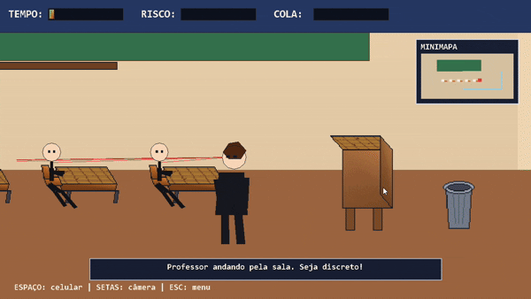</td>
  </tr>
  <tr align="center">
    <td><strong>Janela, Viewport e Zoom</strong></td>
    <td>Aplicados na câmera principal, no minimapa e no zoom com scroll do mouse.</td>
    <td>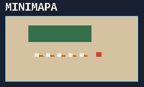</td>
  </tr>
  <tr align="center">
    <td><strong>Cohen-Sutherland</strong></td>
    <td>Usado no recorte das linhas de visão do professor durante a partida.</td>
    <td>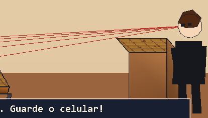</td>
  </tr>
  <tr align="center">
    <td><strong>Mapeamento de Textura</strong></td>
    <td>Aplicado nas mesas dos alunos e na mesa do professor.</td>
    <td>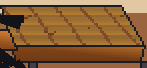</td>
  </tr>
  <tr align="center">
    <td><strong>Input</strong></td>
    <td>Usado no teclado para ações do jogador e no mouse para o zoom da câmera.</td>
    <td></td>
  </tr>
  <tr align="center">
    <td><strong>Menu interativo</strong></td>
    <td>Implementado na tela inicial com botão, teclado e navegação visual.</td>
    <td>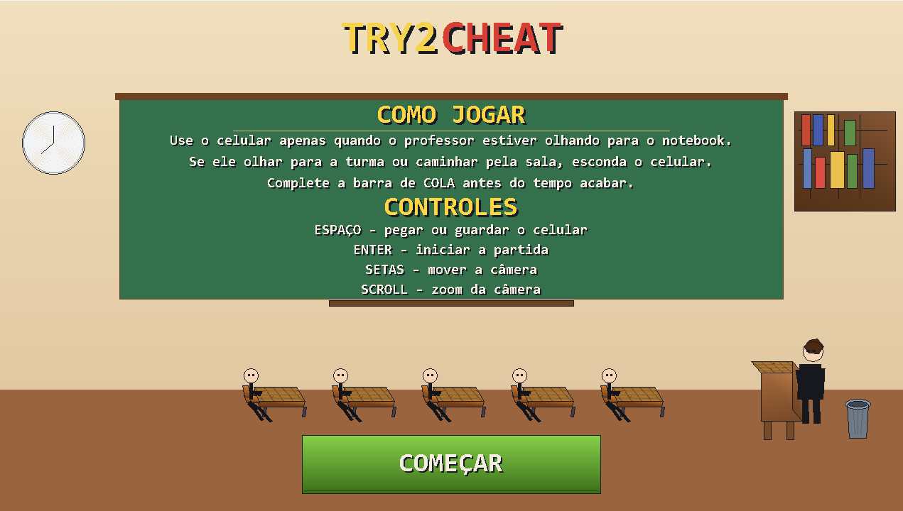</td>
  </tr>
</table>

---

## 🧩 Estrutura do projeto

- `main.py` → inicializa e executa o jogo
- `scenes.py` → menu, jogo e game over
- `entities.py` → aluno, professor e carteiras
- `algorithms.py` → algoritmos de computação gráfica
- `ui.py` → botões, painéis e textos
- `settings.py` → constantes e configurações
- `assets` → imagens de texturas e gifs

---

## 🚀 Como executar

### 1. Requisitos
Tenha o **Python 3** instalado na máquina.

### 2. Instale a biblioteca
```bash
pip install pygame
```

### 3. Execute o projeto
```bash
python main.py
```

---

## 👨‍💻 Autoria


<div align="left">
  
  &nbsp;&nbsp;
  
</div>

<hr>

<div align="left">
  
  &nbsp;&nbsp;
  
</div>

<hr>

<div align="left">
  
  &nbsp;&nbsp;
  
</div>
